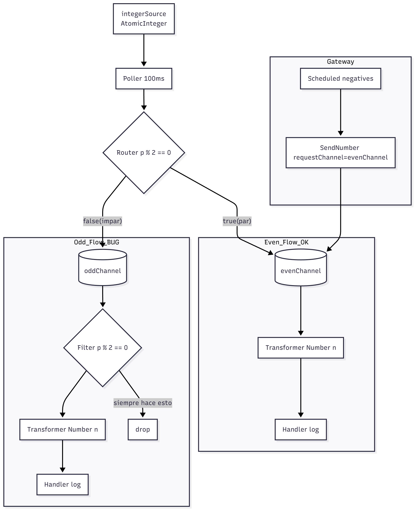

# Lab 5 Integration and SOA - Project Report

## 1. EIP Diagram (Before)

 

Descripción de lo que hace el starter (con bugs):
- Un `AtomicInteger` (bean `integerSource`) genera números secuenciales cada 100 ms (poller).
- Un router decide el canal según `p % 2 == 0`:
  - Pares → `evenChannel`.
  - Impares → `oddChannel`.
- En `evenChannel` (pub/sub) el flujo transforma `Int -> "Number n"` y lo maneja (log).
- En `oddChannel` ocurre lo problemático:
  - El filtro del `oddFlow` estaba invertido: usaba `p % 2 == 0`, aceptando pares y rechazando impares (los verdaderos destinatarios de ese flow).
  - Además `oddChannel` era un `DirectChannel` con dos suscriptores:  `oddFlow` y `SomeService`, compitiendo en load-balancing. Resultado: algunos impares iban al `oddFlow` (donde podían ser rechazados) y otros iban directo a `SomeService` (sin transformar), produciendo comportamiento inconsistente.
  - El `discardChannel` existía pero no estaba conectado, así que los mensajes rechazados se perdían sin trazabilidad.
- El `MessagingGateway SendNumber` inyectaba números negativos en `evenChannel`, saltándose el router. Así, impares negativos terminaban procesándose como pares.

---

## 2. What Was Wrong

- Bug 1: Filtro de impares invertido en `oddFlow`.
  - Por qué: condición `p % 2 == 0` (acepta pares) en lugar de aceptar impares.
  - Efecto: todos los impares que entraban al `oddFlow` eran rechazados.
  - Fix aplicado: `p % 2 != 0`.

- Bug 2: Competencia entre `oddFlow` y `SomeService` en `oddChannel` (DirectChannel).
  - Por qué: dos suscriptores al mismo canal directo → load-balancing.
  - Efecto: parte de los impares no pasaban por el filtro/transformer y llegaban al servicio sin transformar.
  - Fix aplicado: se encadena `channel("oddProcessedChannel")` al final del `oddFlow` y se conecta `SomeService` a `oddProcessedChannel`. Así el flujo de impares siempre: oddChannel → filtro → transformer → oddProcessedChannel → SomeService.

- Bug 3: Gateway apuntando a `evenChannel`.
  - Por qué: `@Gateway(requestChannel = "evenChannel")` enviaba negativos directamente a pares.
  - Efecto: impares negativos tratados como pares, saltándose el filtro/transformador de impares.
  - Fix aplicado: `@Gateway(requestChannel = "oddChannel")` (según requisitos dados para que negativos sigan la ruta de impares).

---

## 3. What You Learned

- Spring Integration DSL en Kotlin: definición de flows con `integrationFlow`, uso de `route`, `filter`, `transform`, `handle`, configuración de `poller` y `@ServiceActivator`.
- Desacoplo: separar el procesamiento (flow) del consumo final (`SomeService`) mediante un canal intermedio (`oddProcessedChannel`) elimina carreras y comportamientos inconsistentes.

---

## 4. AI Disclosure
**Did you use AI tools?** (ChatGPT, Copilot, Claude, etc.)

YES, ChatGPT para la redacción y estructuración del reporte (como suelo hacer, redacto todo y luego utilizo la IA para que lo edite de forma profesional). Y utilicé Copilot para que me ayudase a generar el diagrama, ya que no 
comprendía cómo hacer bien el markdown para mermaid y estaba teniendo problemas para que me generase el diagrama correctamente.

## Additional Notes
- Quiero destacar que todas las preguntas que se van haciendo en el guion, las he ido respondiendo en forma de comentarios en el propio código, esto me ayudó a entender mejor el flujo general e identificar los bugs más fácilmente.

